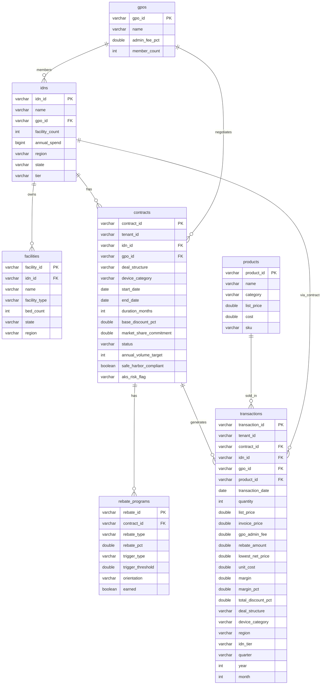

# COPPER POC — Data Model

Entity-relationship diagram for the MedTech pricing intelligence database (DuckDB).

## Entity relationship diagram



## Hierarchy (conceptual)

```
GPO (Group Purchasing Organization)
 └── IDN (Integrated Delivery Network / Hospital System)
      └── Facility (Hospital, ASC, Clinic)

Vendor (tenant) → Contracts → Transactions
Products → Transactions
Contracts → Rebate Programs
```

## Analytical views (derived)

| View | Purpose |
|------|---------|
| `v_portfolio_summary` | Revenue, margin, contract count by device_category, deal_structure (and tenant_id) |
| `v_price_waterfall` | Avg list, discount, GPO fee, rebate, lowest net, cost, margin by device_category (and tenant_id) |
| `v_customer_performance` | Per-IDN revenue, margin, contract count (and tenant_id) |
| `v_monthly_trends` | Monthly revenue, margin, discount by device_category (and tenant_id) |
| `v_contract_risk` | Per-contract risk status, revenue, margin (and tenant_id) |

All views are built from `transactions` and/or `contracts` and include `tenant_id` for multi-tenant isolation.
